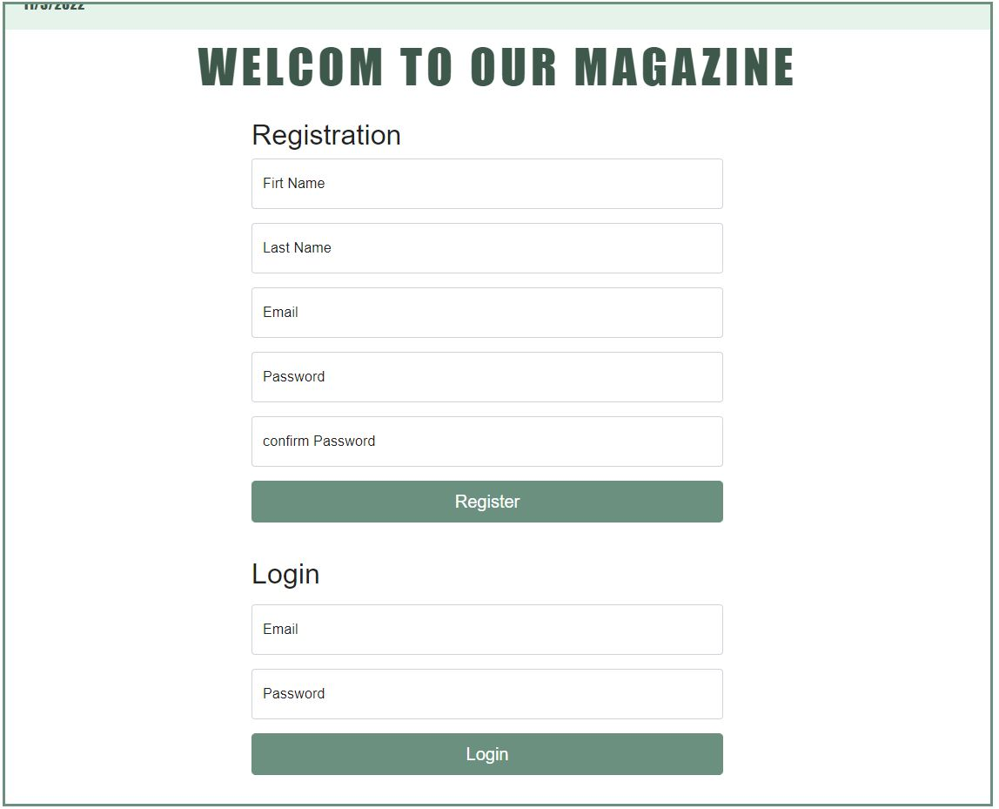

Hi There !! 
This is our very first Mern project and we are very proud about it.

# Masar
## What is Filistin ?
This web application is an online 
magazine that will help to document Palestinian Cities and Villages and allow the world 
to get to know more about Palestine. We got motivated to create this magazine because of the situation that
Palestine is facing so we can show the world what is real Palestine. 

## Programing Languages, Frameworks and Libraries used:
HTML, CSS, Mern, JavaScript, Mern Auth, BootStrap , Trello, GitHub, MATERIAL UI, Socket. 

## Deployment Server:
Amazon Web Srvices

## Data Base:
Mongoose

## Some Screenshots of the Website: 

## Functionality ?
The website will target two types of users, Hikers “Guests” who are looking for information about trails, and Clients “Hikes Organizers” who create hiking trips for hikers “Guests” to join. Spring  Security was used to specify the access and authorization rights for each user of the website.An external API was integrated into the website to determine the starting and ending points for each trail to provide the user with additional details about the trails.

## About us ? 
This Website was designed by three enthusiastic junior Web-Devlopers, The idea of the website was initiated from the need of stimulating tourism on both local and national domains, therefore encouraging people to know the story and history of palestine, our application is the voice of Palestine,reminding people from all over the world that once upon a time free souls has lived here, held their ground and defended their identities.

Designed and maintained By: __Mohammad Omair,  Mubarak Mubarak,  Masa Shabib__
