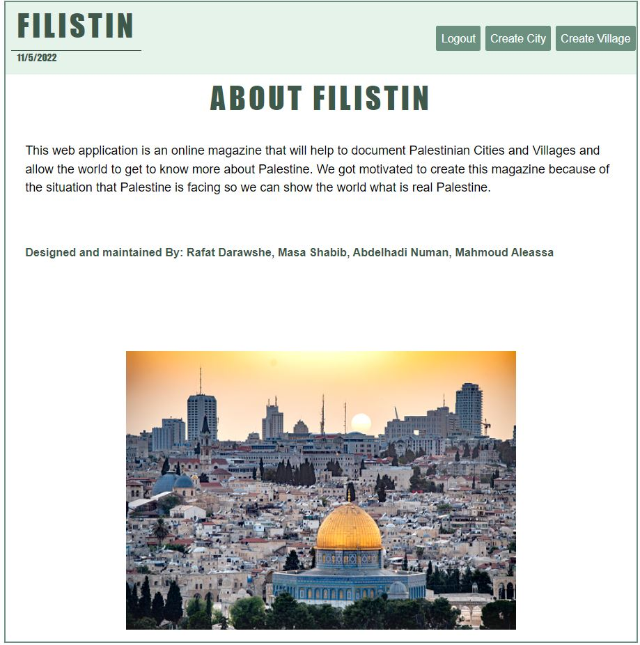

Hi There !! 
This is our very first Mern project and we are very proud about it.

# Filistin
## What is Filistin ?
This web application is an online 
magazine that will help to document Palestinian Cities and Villages and allow the world 
to get to know more about Palestine. We got motivated to create this magazine because of the situation that
Palestine is facing so we can show the world what is real Palestine. 

## Programing Languages, Frameworks and Libraries used:
HTML, CSS, Mern,ReactJS, ExpressJS JavaScript, Mern Auth, BootStrap , Trello, GitHub, MATERIAL UI, Socket. 

## Deployment Server:
Amazon Web Srvices

## Data Base:
Mongoose

## Some Screenshots of the Website: 

## Functionality ?
The website will target two types of users, Documenters that will document Palestine cities and villages, and Readers who are willing to get to know more about Palestine. Registering was used to specify the access and authorization rights for users of the website.Socket was used to create some kind of live chat between the readers of the magazine.

## About us ? 
This web application is an online 
magazine that will help to document Palestinian Cities and Villages and allow the world 
to get to know more about Palestine. We got motivated to create this magazine because of the situation that
Palestine is facing so we can show the world what is real Palestine.

Designed and maintained By: __Masa Shabib, Rafat Darawshe, Abdelhadi Numan, Mahmoud Aleassa__

